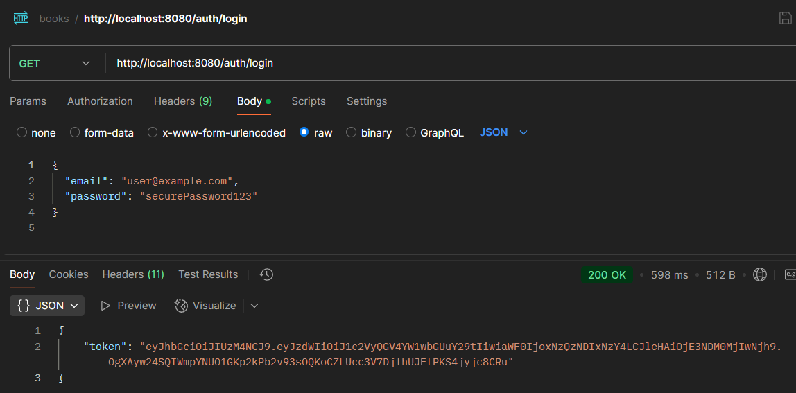
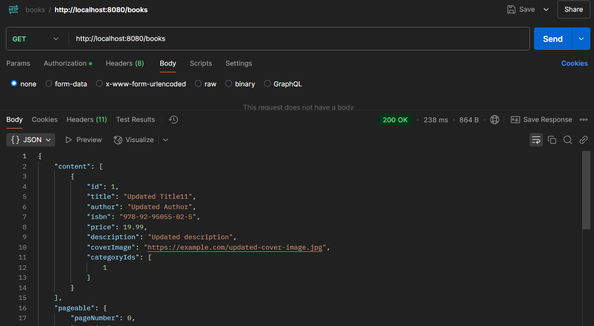
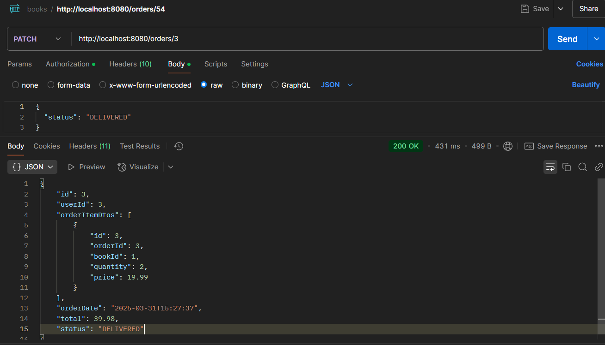
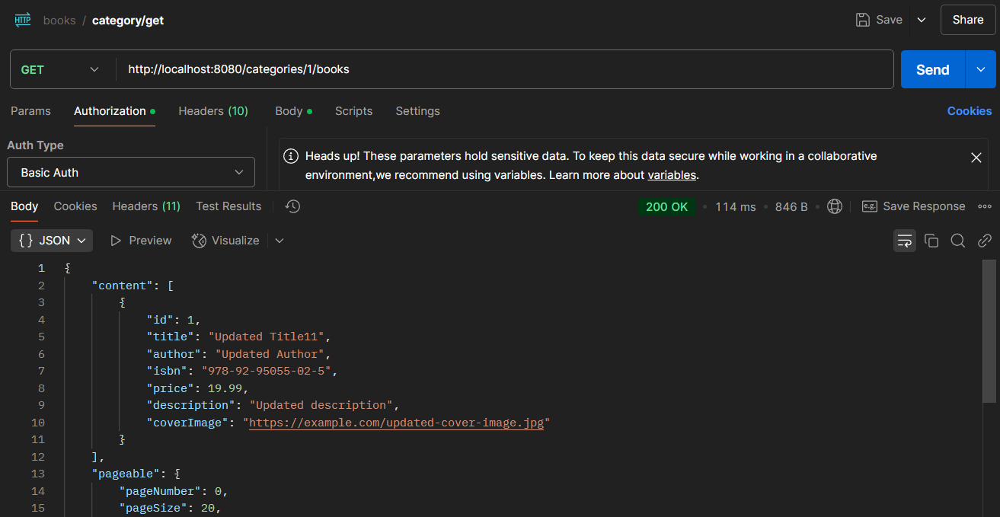
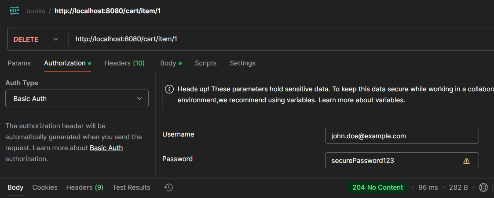
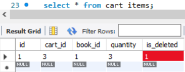
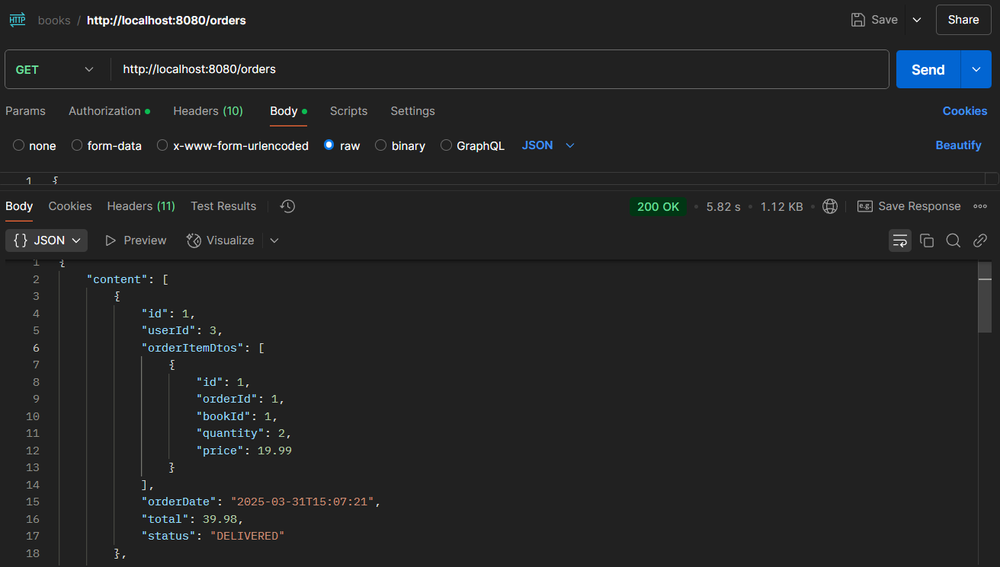

Writing the book-store project was my task. 
In it, we can register as a user, view a list of books, sort them, or search by categories. 
We can also add a book to the cart and create an order.

For developing the book-store, I used the following technologies:

        Spring Boot,
        Spring Web,
        Spring Security,
        Spring Data JPA,
        Swagger,
        Mapstruct,
        Liquibase,
        MySQL,
        H2,
        Spring Tests,
        Docker.

Book-store`s endpoints:

	Auth (/auth):
   	 	GET: /registration - Register a new user
   	 	GET: /login - Retrieve a token for Bearer authentication

	Book (/books):
		GET: / - Retrieve a list of books
  	 	POST: / - Add a new book (ADMIN only)
  	 	PUT: /{id} - Update a book by ID (ADMIN only)
 	 	DELETE: /{id} - Soft delete a book (ADMIN only)
 	 	GET: /search - Search for books using parameters

	Categories (/categories):
    		GET: / - Retrieve a paginated list of categories
    		POST: / - Create a new category (ADMIN only)
    		PUT: /{id} - Update a category by ID (ADMIN only)
    		GET: /{id} - Retrieve a category by ID
    		DELETE: /{id} - Soft delete a category (ADMIN only)
    		GET: /{id}/books - Retrieve books by category

	Cart (/cart):
    		GET: / - Retrieve the authenticated user's cart
    		POST: / - Add an item to the cart
    		PUT: /item/{cartItemId} - Update the quantity of an item in the cart
    		DELETE: /item/{cartItemId} - Soft delete an item from the cart

	Orders (/orders):
    		GET: / - Retrieve a paginated list of user orders
   		GET: /{id}/items - Retrieve items in a user's order
    		GET: /{id}/items/{orderId} - Retrieve a specific item from an order
    		POST: / - Create a new order
    		PATCH: /{id} - Update order status (ADMIN only)

Some screens showing book-store`s work:

	/auth/login:

	/books:

	/books/search:

	/categories/{id}/books:

	/cart:

	/cart/item/{id}:

 - Soft deleting

	/orders:

	/orders/{id}:

To use the book-store you should have docker desktop and change data in .env to your.
Then you have to write command in console:

	docker-compose build

	docker-compose up (run project)

	docker-compose down (stop project)

There are some requests with JSON body you should know:

[GET] /auth/registration:

	{
  	  "email": "string",
  	  "password": "stringst",
  	  "repeatPassword": "stringst",
  	  "firstName": "string",
  	  "lastName": "string",
  	"shippingAddress": "string"
	}

[GET] /auth/login:
	
    {
  	  "email": "string",
    	  "password": "string"
	}

[POST] /books:

	{
  	  "title": "string",
  	  "author": "string",
  	  "isbn": "string",
  	  "price": 0,
  	  "description": "string",
  	  "coverImage": "path",
  	  "categoryIds": [
    		9007199254740991
  	  ]
	}

[PUT] /books{id}:

	{
  	  "title": "string",
  	  "author": "string",
  	  "isbn": "string",
  	  "price": 0,
  	  "description": "string",
  	  "coverImage": "path",
  	  "categoryIds": [
    		9007199254740991
  	  ]
	}

[GET] /books/search:

	{
  	  "title": "string",
  	  "author": "string",
	  "isbn": "string"
	}

[POST] /categories:

	{
  	  "name": "string",
  	  "description": "string"
	}

[PUT] /categories/{id}:
	
{
  	  "name": "string",
  	  "description": "string"
	}

[POST] /orders:

	{
  	  "shippingAddress": "string"
	}

[PATCH] /orders/{id}:

	{
  	  "status": "COMPLETED"
	}

[POST] /cart:

	{
  	  "bookId": 9007199254740991,
  	  "quantity": 1073741824
	}

[PUT] /cart/item/{id}:

	{
  	  "bookId": 9007199254740991,
  	  "quantity": 1073741824
	}

Briefly, I was interested while writing the book store project. I learned a lot about Spring, project structure, and potential problems I might encounter.
The hardest part was implementing authentication logic and the filter chain.
And here you can see the result:

	https://www.loom.com/share/d88f5029f0d1468082a609b2caf65e0a
